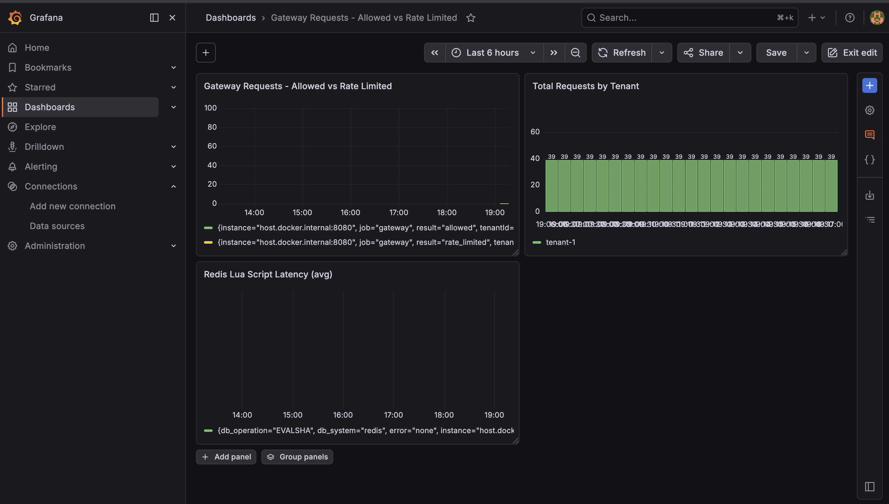
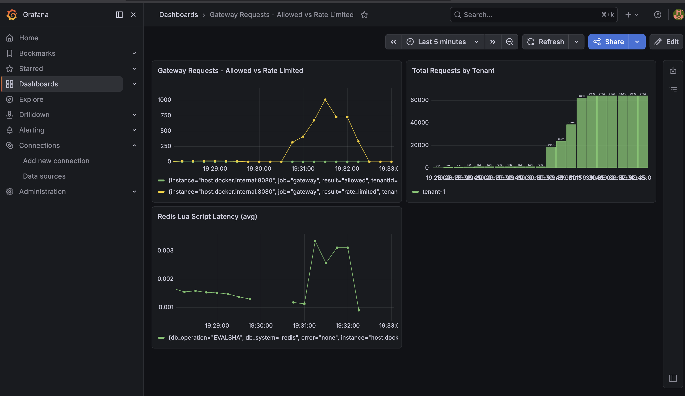

# Multi-Tenant Distributed Rate Limiter / API Gateway

## Problem Statement

API gateways need to enforce different rate limits per tenant, but naive in-memory
rate limiting breaks the moment you run more than one gateway instance — each
instance has its own counter, so a tenant can exceed their actual limit by
distributing requests across nodes. This project builds a multi-tenant API
gateway with distributed rate limiting that stays correct under horizontal
scaling, with limits configurable per tenant without redeploying.

## Why This Project

At SkyTrade, I built a multi-tenant platform with per-tenant data isolation,
and separately built a cron-based system that had to avoid duplicate
processing across concurrent runs. This project generalizes both problems —
multi-tenant isolation and correctness under concurrency — into a single
piece of reusable infrastructure, built and load-tested properly instead of
as one-off business logic.

## Scope

### In Scope (v1)
- Two rate-limiting algorithms: token bucket and sliding window log
- Per-tenant rate limit configuration (API key → tenant → limit), data model
  designed to allow per-endpoint limits later (not implemented in v1)
- Distributed state via Redis, correct across multiple gateway instances
- Reverse-proxy routing to at least one real backend service
- Circuit breaking for unhealthy upstreams *(stretch — cut first if behind schedule)*
- Structured logging + basic Prometheus metrics (requests allowed/rejected, latency)
- Admin API to add/update tenant limits at runtime
- Load testing with published results (req/sec, p99 latency, behavior during
  Redis failover)

### Out of Scope (v1)
- Full auth/authz beyond API key lookup
- Any UI/dashboard
- Multi-region or multi-datacenter deployment
- More than 2 rate-limiting algorithms
- Kubernetes — single container/VM deployment is enough
- Per-endpoint limits (designed for, not built)

### Stretch Goals (only if time permits)
- Custom-built reverse proxy/routing layer instead of Spring Cloud Gateway
- Circuit breaking (if not completed in main scope)

## Tech Stack

| Component        | Choice                                  |
|-------------------|------------------------------------------|
| Language/Framework | Java 21, Spring Boot 3.x                |
| Gateway           | Spring Cloud Gateway                     |
| Distributed state | Redis (Lettuce client)                   |
| Tenant config store | PostgreSQL                             |
| Observability     | Spring Actuator + Prometheus             |
| Local dev         | Docker Compose                           |
| Deployment        | Fly.io / Railway (free tier)             |
| Load testing      | k6 (or similar)                          |

## Architecture (high level)

```
        ┌─────────────┐
Client ─▶  API Gateway  ──┬──▶ Redis (rate limit state, per-tenant counters)
        │ (Spring Cloud │  │
        │   Gateway)    │  ├──▶ Postgres (tenant config: API key → limit)
        └───────┬───────┘  │
                │           └──▶ Backend Service(s) (proxied requests)
                ▼
          Admin API (manage tenant limits at runtime)
```

## Getting Started

See `PROGRESS.md` for current build status and next steps.

```bash
docker compose up
```

## Observability

Prometheus scrapes gateway metrics from Spring Actuator, and Grafana visualizes
the gateway traffic and rate-limit behavior.



## Load Test Results

Tested with k6 across three scenarios: steady load (3 req/s), burst (20 req/s), and multi-tenant isolation.
 
| Metric | Result |
|--------|--------|
| p50 latency | 2.53ms |
| p90 latency | 4.37ms |
| p95 latency | 5.88ms |
| p99 latency | 42.51ms |
| Max latency | 141ms |
| Total requests | 1,293 |
| Allowed (200) | 109 |
| Rate-limited (429) | 1,184 |
| Unexpected errors (5xx) | 0 |
| Checks passed | 100% |
 
**Redis failover test:** Redis was stopped mid-load-test. The gateway continued serving requests via fail-open behavior (all requests allowed through during the outage). Latency spike was visible in Grafana at the Redis stop/start boundary. Zero 500s during the outage.


 
*Note: numbers above are from a local Mac development machine. Deployed free-tier numbers will differ due to resource constraints.*
